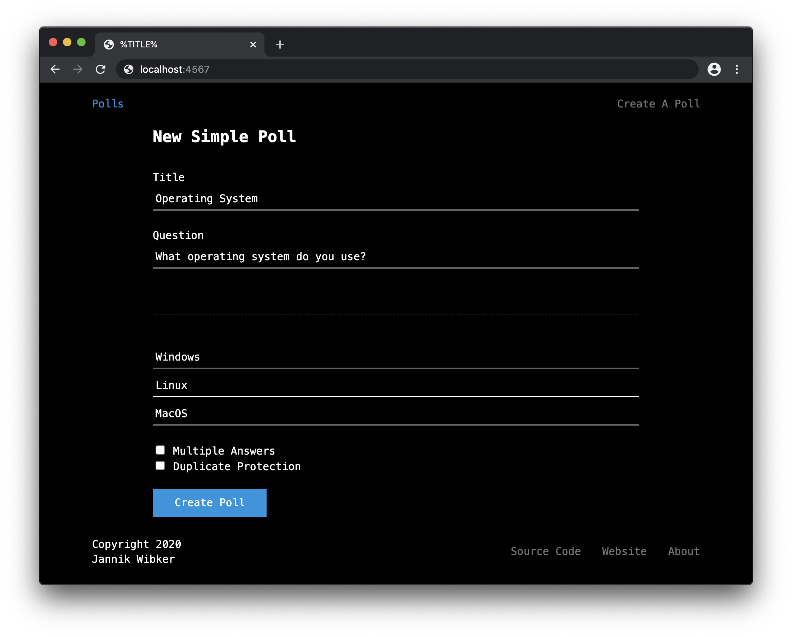

# Polls

A simple tool to create polls & surveys.



> **WIP**

When developing two commands are required to get proper file watching and rebuilding working:

```bash
rerun 'ruby src/main.rb'
rollup src/js/create_simple.js --file file public/js/create_simple.js --format iife --watch # for create_simple, still working on having all files bundled independently
```

## Requirements / Dependencies

- ruby
- sinatra (`gem install sinatra`)
- thin (`gem isntall thin`)
- rerun (`gem install rerun`)
- rollup (`npm install --global rollup`)